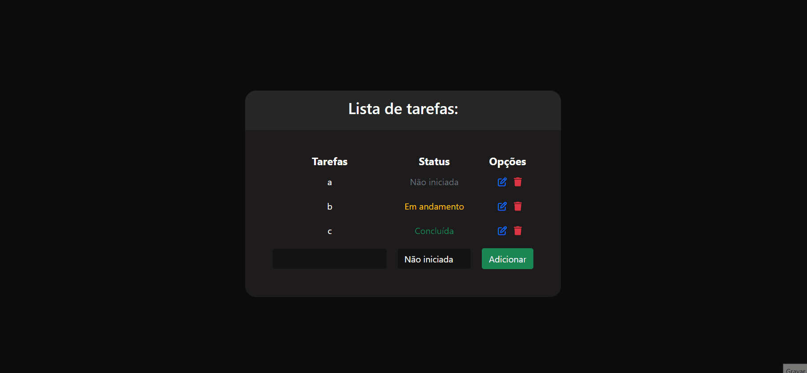

# Projeto ToDo List - Node.js

Este projeto em Node.js é um aplicativo de lista de tarefas (ToDo List) que desenvolvi por conta própria para reforçar os conhecimentos adquiridos em um curso. O projeto incorpora o uso de sessão para funcionalidades de flash messages e alteração dinâmica de cores das tarefas. Ele segue a arquitetura MVC (Model-View-Controller) para organizar o código, implementa operações CRUD (Create, Read, Update, Delete), utiliza a view engine EJS para renderização de páginas e integra o banco de dados MongoDB para armazenar as informações sobre as tarefas.

## Descrição do Projeto

O aplicativo ToDo List permite que os usuários gerenciem suas tarefas de forma eficiente. Cada tarefa possui as seguintes informações:

- Nome da Tarefa
- Status (Não Iniciada, Em Andamento, Concluída)

O sistema de sessão é utilizado para funcionalidades específicas, como flash messages. Não há autenticação de usuário no projeto.

## Tecnologias Utilizadas

- **Node.js:** Plataforma de desenvolvimento server-side baseada no motor V8 do Google Chrome.
- **Express:** Framework web para Node.js, utilizado para simplificar o desenvolvimento de aplicações web.
- **MongoDB:** Banco de dados NoSQL utilizado para armazenar as informações das tarefas.
- **EJS (Embedded JavaScript):** View engine para Node.js, facilitando a renderização de páginas HTML dinâmicas.
- **dotenv:** Biblioteca para carregar variáveis de ambiente a partir de um arquivo `.env`.
- **Funcionalidades de Sessão:** Uso de sessões para flash messages e outras operações específicas.

## Estrutura do Projeto

O projeto segue o padrão MVC, dividindo as responsabilidades em:

- **Model (models):** Responsável pela definição dos objetos e interações com o banco de dados MongoDB.
- **View (views):** Contém os arquivos EJS para renderização das páginas HTML, incluindo a estilização.
- **Controller (controllers):** Gerencia as requisições do usuário, interagindo com os modelos e renderizando as views.

## Funcionalidades

- Adição de tarefas
- Visualização de tarefas
- Atualização de status das tarefas (Não Iniciada, Em Andamento, Concluída)
- Exclusão de tarefas

## Estilização Frontend

O frontend foi estilizado para proporcionar uma melhor experiência ao usuário. A cor das tarefas é alterada dinamicamente de acordo com o seu status, facilitando a identificação visual de tarefas concluídas, em andamento e não iniciadas.

## Pré-requisitos

- Node.js instalado
- MongoDB instalado e em execução

## Como Executar o Projeto

1. Clone o repositório: `https://github.com/Caahmos/ProjetoToDoList.git`
2. Acesse o diretório do projeto: `cd nome-do-repositorio`
3. Instale as dependências: `npm install`
4. Crie um arquivo `.env` na raiz do projeto e configure as variáveis necessárias.
5. Inicie o servidor: `npm start`
6. Abra o navegador e acesse `http://localhost:3000` para visualizar a aplicação.

## Contribuição

Contribuições são bem-vindas! Sinta-se à vontade para abrir issues, propor melhorias ou enviar pull requests.
